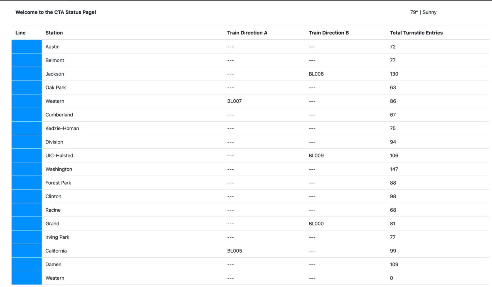

# Optimize Chicago Bus and Train Availability Using Kafka

In this project, you will construct a streaming event pipeline around Apache Kafka and its ecosystem. Using public data from the Chicago Transit Authority we will construct an event pipeline around Kafka that allows us to simulate and display the status of train lines in real time.

When the project is complete, you will be able to monitor a website to watch trains move from station to station. So a sample static view of the website page you create might look like this:

## Project

### Prerequisites
To complete your project locally, the following are required:

### Docker
- Python 3.7
- A minimum of 16gb+ RAM and a 4-core CPU on your computer to execute the simulation

### Description

- Optimize Chicago Bus and Train Availability Using Kafka: A streaming event pipeline around Apache Kafka and its ecosystem. Using public data from the Chicago Transit Authority we will construct an event pipeline around Kafka that allows us to simulate and display the status of train lines in real time. tools: python, Kafka, Faust Stream processor and KSQL.

- Analyze San Francisco Crime Rate with Apache Spark Streaming: real-world dataset, extracted from Kaggle, on San Francisco crime incidents, and you will provide statistical analyses of the data using Apache Spark Structured Streaming. tools: python, Kafka, Spark Streaming.

## Licence
This work is licensed under a Creative Commons Attribution-NonCommercial-NoDerivatives 4.0 International License. Please refer to Udacity Terms of Service for further information.
